# AWS RDS PostgreSQL Database Project


## Project Overview

As part of my AWS Cloud Engineering learning journey, I completed a hands-on project deploying a PostgreSQL database using Amazon RDS.

I used an AWS engineering tutorial as a learning reference and independently completed the **CLI-based deployment, configuration, testing, monitoring and cleanup** of the environment.

The project focused on building a secure RDS environment with a custom VPC, private database subnets, a public bastion host, security groups, Multi-AZ deployment, automated backups and CloudWatch alarms.

The infrastructure was provisioned using **AWS CLI commands from AWS CloudShell**, with Bash scripting used to automate deployment and cleanup.

> **Note:** This repository documents my implementation and learning. The tutorial used as the learning reference is acknowledged at the end of this README.

---

## Project Highlights

- Built a PostgreSQL database using Amazon RDS
- Designed a custom VPC for the database environment
- Created private subnets across two Availability Zones for RDS
- Created a public subnet for a bastion host
- Configured security groups to control SSH and PostgreSQL traffic
- Disabled public accessibility for the RDS database
- Enabled RDS Multi-AZ deployment
- Enabled storage encryption and automated backups
- Configured a custom PostgreSQL parameter group
- Connected to the private database through a bastion host
- Installed and used the PostgreSQL client
- Configured CloudWatch alarms for CPU utilization and free storage
- Validated database connectivity and RDS configuration
- Created a cleanup script to remove project resources

---

## Architecture

The environment was designed so that the PostgreSQL database remains in private subnets and is accessed through a bastion host.

```text
                         Internet
                             |
                             v
                    +----------------+
                    | Internet       |
                    | Gateway        |
                    +-------+--------+
                            |
                            v
                 +----------------------+
                 | Public Subnet        |
                 |                      |
                 | EC2 Bastion Host     |
                 +----------+-----------+
                            |
                         SSH / 5432
                            |
                            v
              +-------------------------------+
              |             VPC               |
              |                               |
              |  +---------------------------+ |
              |  | Private Subnet - AZ 1     | |
              |  |                           | |
              |  | RDS PostgreSQL            | |
              |  | Primary                   | |
              |  +---------------------------+ |
              |                               |
              |  +---------------------------+ |
              |  | Private Subnet - AZ 2     | |
              |  |                           | |
              |  | RDS Multi-AZ Standby      | |
              |  +---------------------------+ |
              +---------------+---------------+
                              |
                              v
                     Amazon CloudWatch
                    Metrics and Alarms
```

### Architecture Design

The main traffic flow is:

```text
Developer
   |
   | SSH
   v
Bastion Host
   |
   | PostgreSQL / TCP 5432
   v
Private RDS PostgreSQL
```

The database was configured with **public accessibility disabled**, so it was not exposed directly to the internet.

---

## AWS Services Used

| AWS Service | Purpose |
|---|---|
| Amazon RDS | Managed PostgreSQL database |
| Amazon VPC | Isolated network environment |
| Amazon EC2 | Bastion host for database administration |
| AWS IAM | AWS resource permissions |
| Amazon CloudWatch | Monitoring and alarms |
| Internet Gateway | Internet connectivity for the public subnet |
| Security Groups | Network-level access control |
| AWS CloudShell | CLI-based deployment environment |

---

## Technologies Used

- AWS CLI
- Bash
- PostgreSQL
- SQL
- Amazon Linux
- Amazon RDS
- Amazon EC2
- Amazon VPC
- Amazon CloudWatch

---

# Deployment

## Deployment Method

The project was deployed using:

- **AWS CLI**
- **AWS CloudShell**
- **Bash scripting**

The CLI approach allowed me to create the environment through repeatable commands rather than relying entirely on manual AWS Console configuration.

---

## 1. Create the VPC

A dedicated VPC was created for the database environment.

The VPC used the following CIDR range:

```text
10.0.0.0/16
```

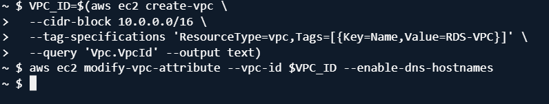

---

## 2. Create Private Subnets for RDS

Two private subnets were created across Availability Zones to support the RDS Multi-AZ configuration.

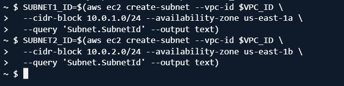

The use of multiple Availability Zones provides the network foundation required for RDS Multi-AZ deployment.

---

## 3. Create a Public Subnet for the Bastion Host

A public subnet was created for the EC2 bastion host.

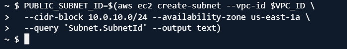

The bastion host provides a controlled administration path into the private database environment.

---

## 4. Configure the Internet Gateway

An Internet Gateway was created and attached to the VPC.

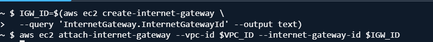

The Internet Gateway provides internet connectivity for resources in the public subnet, including the bastion host.

---

## 5. Configure the Route Table

A route table was created for the public subnet with a route to the Internet Gateway.

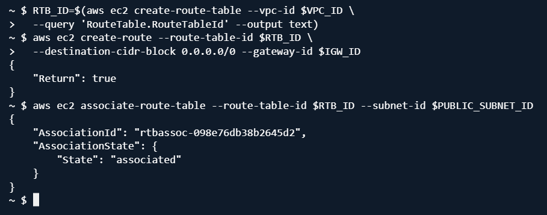

This allows the bastion host in the public subnet to communicate with the internet.

---

# Security Configuration

## 6. Create the RDS Security Group

A dedicated security group was created for the PostgreSQL RDS instance.

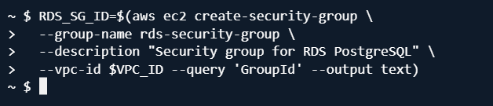

The RDS security group controls access to PostgreSQL on port `5432`.

---

## 7. Create the Bastion Security Group

A separate security group was created for the bastion host.

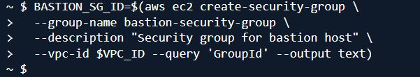

SSH access was restricted rather than allowing unrestricted access from the internet.

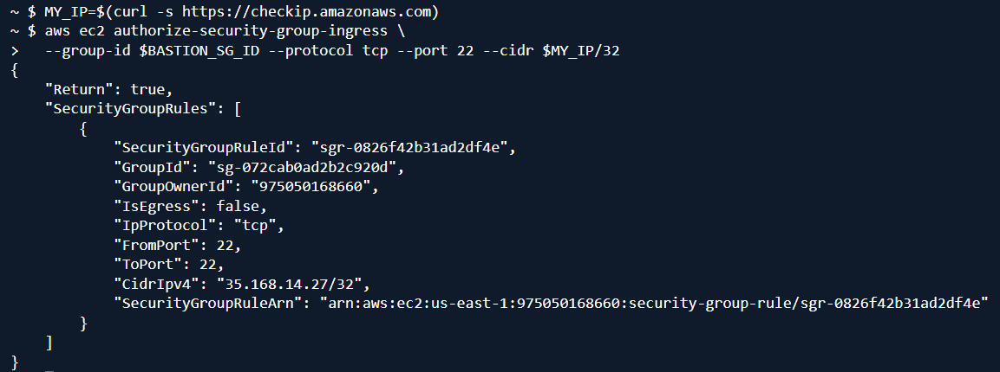

Additional validation of the security group configuration was performed during deployment.

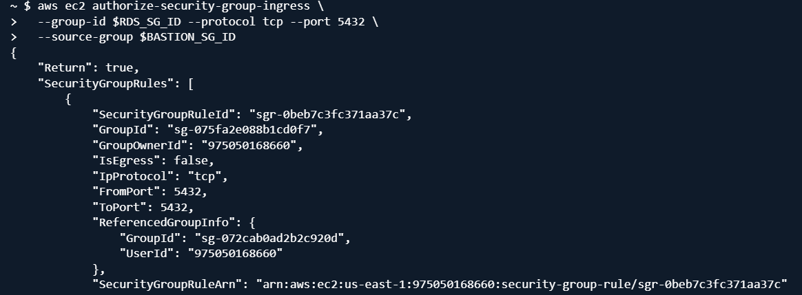

### Security Architecture

The intended access path was:

```text
My IP
  |
  | SSH / TCP 22
  v
Bastion Host
  |
  | PostgreSQL / TCP 5432
  v
RDS PostgreSQL
```

The RDS database was not made publicly accessible.

---

# RDS Configuration

## 8. Create the DB Subnet Group

A DB subnet group was created using the private RDS subnets.

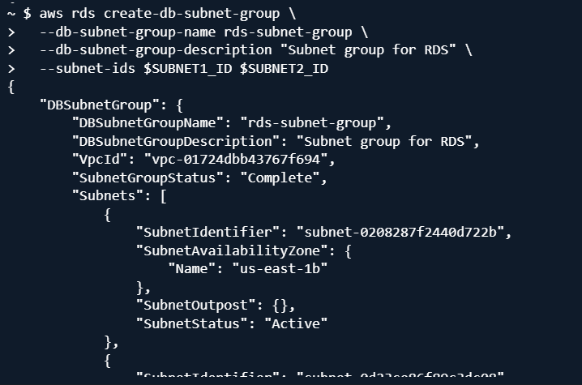

This allows Amazon RDS to place the database within the private subnet environment.

---

## 9. Create a Custom PostgreSQL Parameter Group

A custom parameter group was created for the PostgreSQL database.

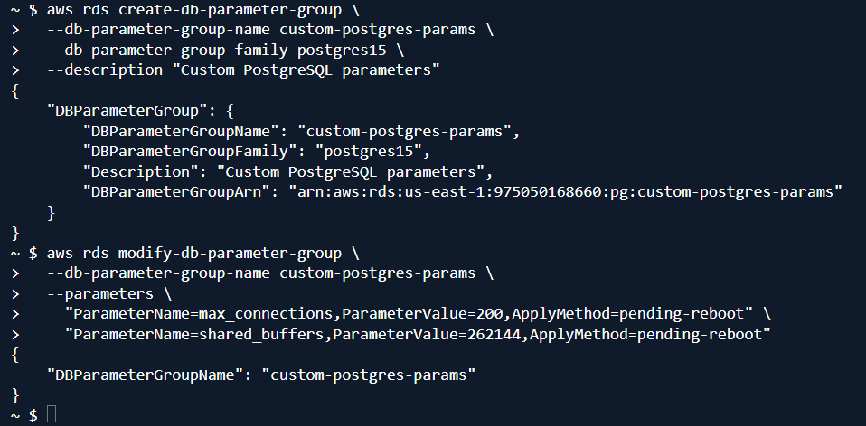

The parameter group was configured as part of the project's performance-testing requirements.

---

## 10. Create the RDS PostgreSQL Instance

The RDS instance was created using the AWS CLI.

The deployment configuration included:

| Configuration | Value |
|---|---|
| Database identifier | `my-postgres-db` |
| Engine | PostgreSQL |
| Engine version | PostgreSQL `15.18` |
| Instance class | `db.t3.micro` |
| Allocated storage | `20 GiB` |
| Storage type | `gp3` |
| Storage encryption | Enabled |
| DB subnet group | `rds-subnet-group` |
| Backup retention | `7 days` |
| Multi-AZ | Enabled |
| Public accessibility | Disabled |
| Automatic minor version upgrade | Enabled |

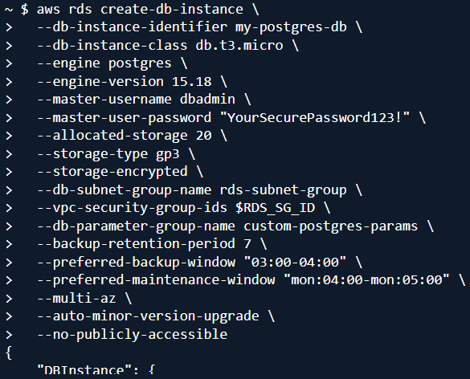

> **Security note:** Database passwords and other secrets should not be committed to GitHub. The password visible in the deployment screenshot is a placeholder used during the learning exercise and should not be reused as a real credential.

---

## 11. Wait for RDS Availability

RDS provisioning can take some time. The AWS CLI wait command was used to wait until the database became available.

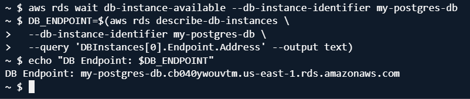

This ensured that subsequent configuration and testing steps were performed only after the RDS instance was ready.

---

# Bastion Host

## 12. Create the EC2 Key Pair

An EC2 key pair was created for secure SSH access to the bastion host.

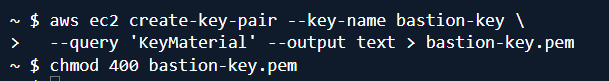

The private key file should never be committed to GitHub.

---

## 13. Retrieve the Latest AMI

The latest suitable Amazon Machine Image (AMI) was retrieved using the AWS CLI.

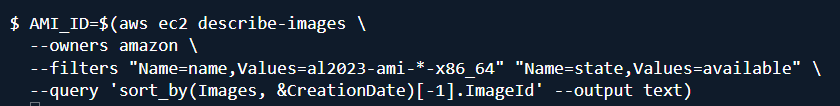

---

## 14. Launch the Bastion Host

An EC2 bastion host was launched in the public subnet.

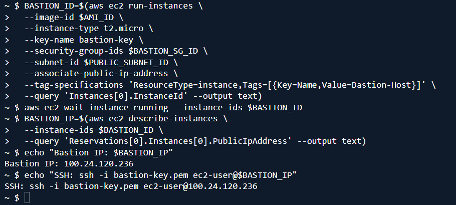

The bastion host acts as the controlled entry point for administering the private RDS database.

---

## 15. SSH into the Bastion Host

The bastion host was accessed using SSH.

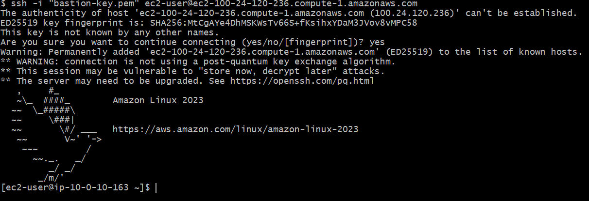

---

## 16. Install PostgreSQL Client

The PostgreSQL client was installed on the bastion host.

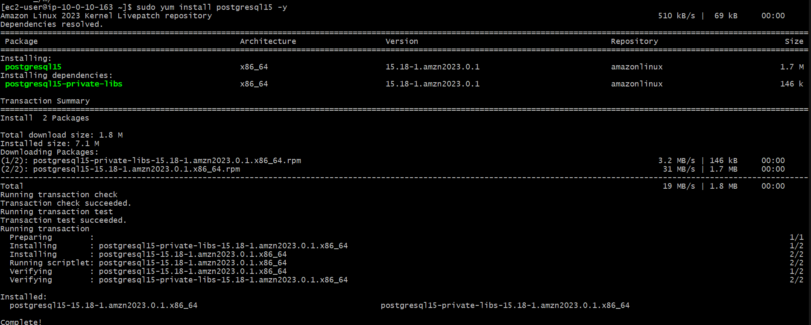

This allowed the bastion host to establish a PostgreSQL connection to the private RDS endpoint.

---

# Database Testing

## 17. Connect to the RDS Database

The PostgreSQL client was used to connect to the RDS database from the bastion host.

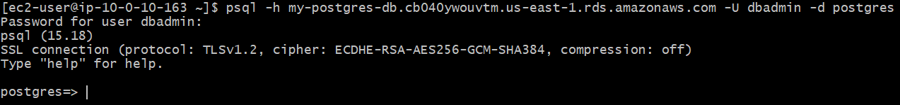

The database endpoint was retrieved from the RDS instance and used for the PostgreSQL connection.

---

## 18. Configure CloudWatch CPU Utilization Alarm

A CloudWatch alarm was created to monitor RDS CPU utilization.

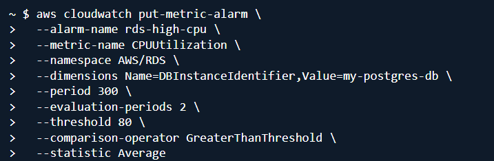

The alarm was configured to detect high CPU utilization on the RDS instance.

---

## 19. Configure CloudWatch Free Storage Alarm

A second CloudWatch alarm was configured to monitor available RDS storage.

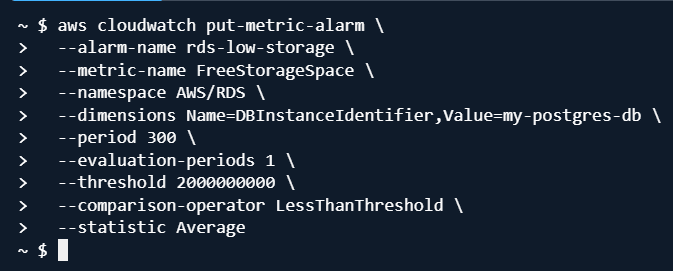

This provides an early warning if available database storage becomes too low.

---

## 20. Confirm Database Connectivity

The database connection was tested and confirmed successfully.

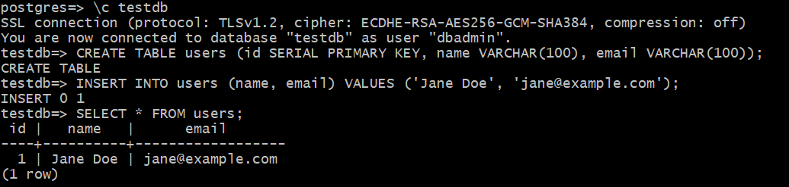

This validated the complete connectivity path:

```text
Bastion Host
      |
      v
PostgreSQL Client
      |
      v
RDS PostgreSQL
```

---

# Monitoring and High Availability

## 21. Confirm Automated Backups

Automated backups were enabled with a **7-day retention period**.

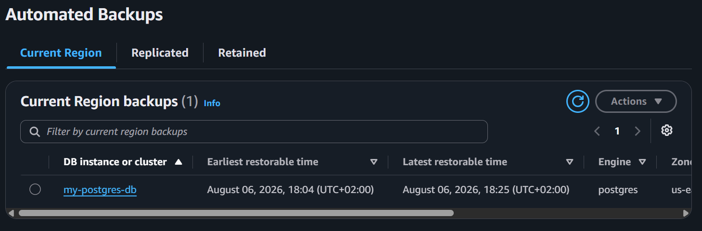

Automated backups provide recovery capability and support point-in-time restoration.

---

## 22. Confirm Multi-AZ Deployment

The RDS instance was confirmed to be configured for Multi-AZ deployment.

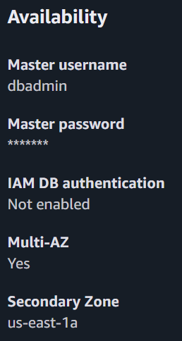

Multi-AZ provides a standby database in another Availability Zone and supports automatic failover if the primary database becomes unavailable.

---

## 23. Confirm CloudWatch Alarms

The CloudWatch dashboard was checked to confirm that the configured RDS alarms were present.

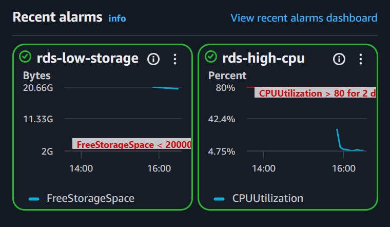

Additional alarm details were also reviewed.

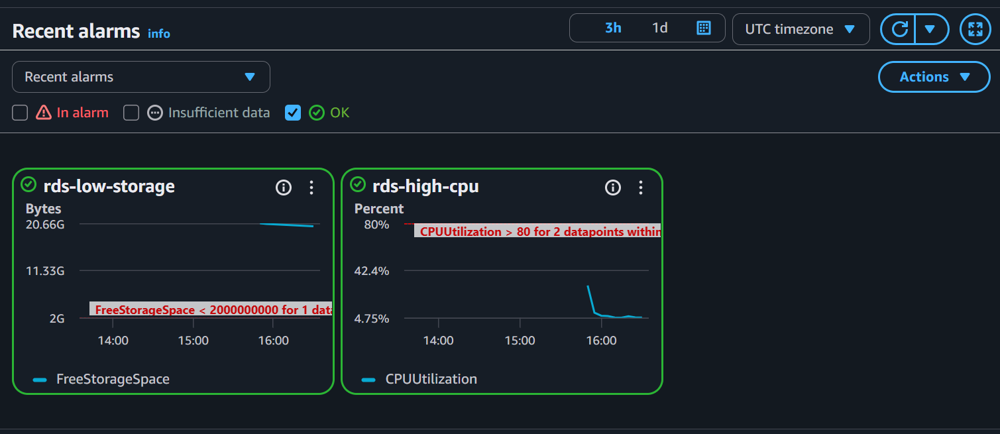

The configured monitoring focused on:

- CPU utilization
- Free storage space

---

# Testing and Validation

The project was validated across multiple layers.

### Infrastructure

- [x] VPC created
- [x] Private RDS subnets created
- [x] Public bastion subnet created
- [x] Internet Gateway configured
- [x] Route table configured
- [x] Security groups configured

### Database

- [x] PostgreSQL RDS instance created
- [x] RDS endpoint retrieved
- [x] Database connection established
- [x] Public accessibility disabled
- [x] Storage encryption enabled
- [x] Automated backups enabled
- [x] Multi-AZ enabled

### Bastion Host

- [x] EC2 key pair created
- [x] Bastion host launched
- [x] SSH connection established
- [x] PostgreSQL client installed
- [x] Database connection tested

### Monitoring

- [x] CPU utilization alarm created
- [x] Free storage alarm created
- [x] CloudWatch alarms confirmed

---

# Challenges and Troubleshooting

## PostgreSQL Engine Version

During the project, the PostgreSQL engine version required validation against the versions supported by Amazon RDS in the selected AWS environment.

The deployment was ultimately completed using PostgreSQL **15.18**, as shown in the successful RDS creation command.


This reinforced the importance of checking supported AWS service versions rather than assuming that a version from a tutorial will always be available.

---

## RDS Provisioning Time

RDS takes longer to provision than many of the other resources created during the project.

To handle this, the AWS CLI wait command was used to pause execution until the database became available.


---

## Private Database Connectivity

The RDS instance was deliberately configured without public accessibility.

This meant that the database could not be connected to directly from the local machine.

The solution was to use the EC2 bastion host as an administrative jump point:

```text
Local Machine
     |
     | SSH
     v
Bastion Host
     |
     | PostgreSQL 5432
     v
Private RDS
```

This provided a more secure architecture than exposing the database directly to the internet.

---

## Security Group Configuration

Database connectivity depended on correctly configuring the security groups.

The RDS security group was separated from the bastion security group so that database access could be controlled independently.

This reinforced the importance of:

- Security group separation
- Restricting SSH access
- Restricting PostgreSQL access
- Avoiding public database access

---

## Resource Cleanup

After testing, the AWS resources were removed using the cleanup script.

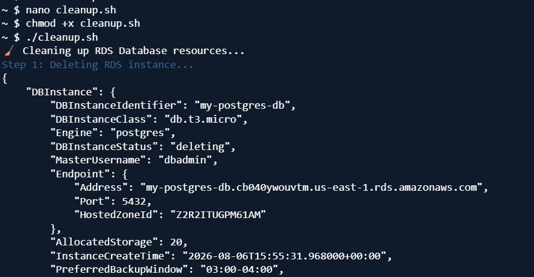

The cleanup completed successfully.

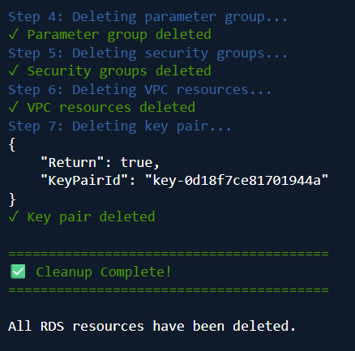

This is important when working with AWS because resources such as RDS and EC2 can incur costs if left running.

---

# Infrastructure Automation

The project was completed using AWS CLI commands from CloudShell, with Bash used to automate the deployment and cleanup process.

The deployment process created the infrastructure required for:

- Networking
- Security
- RDS
- Bastion host
- Monitoring

The cleanup process removed the resources after testing.

This approach made the project more repeatable than performing every step manually through the AWS Management Console.

---

# Security Considerations

The project incorporated several security controls:

- RDS public accessibility disabled
- RDS placed in private subnets
- Bastion host placed in a public subnet
- Security groups used to control network traffic
- SSH access restricted
- PostgreSQL traffic restricted to the required source
- RDS storage encryption enabled
- Database credentials treated as sensitive information
- Private SSH key excluded from version control

### Secrets

No real credentials should be committed to this repository.

The following should always be excluded from Git:

```text
*.pem
.env
AWS access keys
AWS secret keys
Database passwords
deployment-info.txt
```

---

# Cleanup

After completing testing, the project resources were removed using the cleanup script.

```bash
chmod +x cleanup-rds.sh
./cleanup-rds.sh
```

The cleanup process was validated using the AWS CLI.


> Always verify that all billable AWS resources have been removed after completing a learning project.

---

# Skills Demonstrated

- Amazon RDS
- PostgreSQL
- AWS VPC
- Amazon EC2
- AWS IAM
- AWS Security Groups
- Multi-AZ Architecture
- High Availability
- Automated Backups
- Amazon CloudWatch
- AWS CLI
- AWS CloudShell
- Bash Scripting
- SQL
- Database Administration
- Network Security
- Cloud Troubleshooting
- Infrastructure Automation

---

# What I Learned

This project gave me practical experience with designing and deploying a managed relational database environment on AWS.

Key learning outcomes included:

- Designing VPC networking for a database workload
- Working with public and private subnets
- Deploying PostgreSQL using Amazon RDS
- Configuring RDS Multi-AZ
- Enabling automated backups
- Configuring database encryption
- Using security groups to control network access
- Using a bastion host to access a private database
- Connecting to RDS using PostgreSQL
- Monitoring RDS with CloudWatch
- Automating AWS resources using AWS CLI and Bash
- Validating cloud infrastructure after deployment
- Cleaning up AWS resources after testing

The project also reinforced the importance of troubleshooting cloud infrastructure systematically by validating each layer of the architecture rather than treating the environment as a single component.

---

# Future Improvements

Potential improvements to this project include:

- [ ] Convert the infrastructure to Terraform
- [ ] Store database credentials in AWS Secrets Manager
- [ ] Replace the bastion host with AWS Systems Manager Session Manager
- [ ] Add Amazon SNS notifications for CloudWatch alarms
- [ ] Add CI/CD using GitHub Actions
- [ ] Create separate development and production environments
- [ ] Add automated infrastructure testing
- [ ] Add disaster recovery and restore testing
- [ ] Implement more detailed RDS monitoring

---

# Project Outcome

The project successfully demonstrated the deployment of a secure PostgreSQL database environment using Amazon RDS.

The completed environment included:

```text
Custom VPC
   |
   +-- Public Subnet
   |      |
   |      +-- EC2 Bastion Host
   |
   +-- Private Subnet - AZ 1
   |      |
   |      +-- RDS PostgreSQL
   |
   +-- Private Subnet - AZ 2
          |
          +-- RDS Multi-AZ Standby

RDS
 |
 +-- Automated Backups
 |
 +-- Encryption
 |
 +-- CloudWatch Alarms
```

The project provided practical experience across AWS networking, databases, security, high availability, monitoring, troubleshooting and infrastructure automation.

---

# Acknowledgements

This project was completed as part of my AWS Cloud Engineering learning journey using the following tutorial as a learning reference:

**AWS Engineering Project – RDS Database**  
https://github.com/Mide69/AWS-Engineering-Project/tree/main/AWS%20Project%204%20-%20RDS%20Database

The deployment, testing, troubleshooting, screenshots and documentation in this repository represent my own implementation and learning based on the project requirements.

